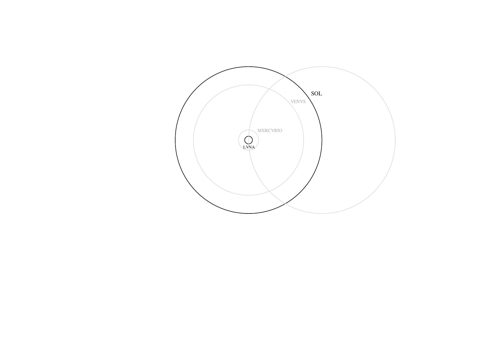
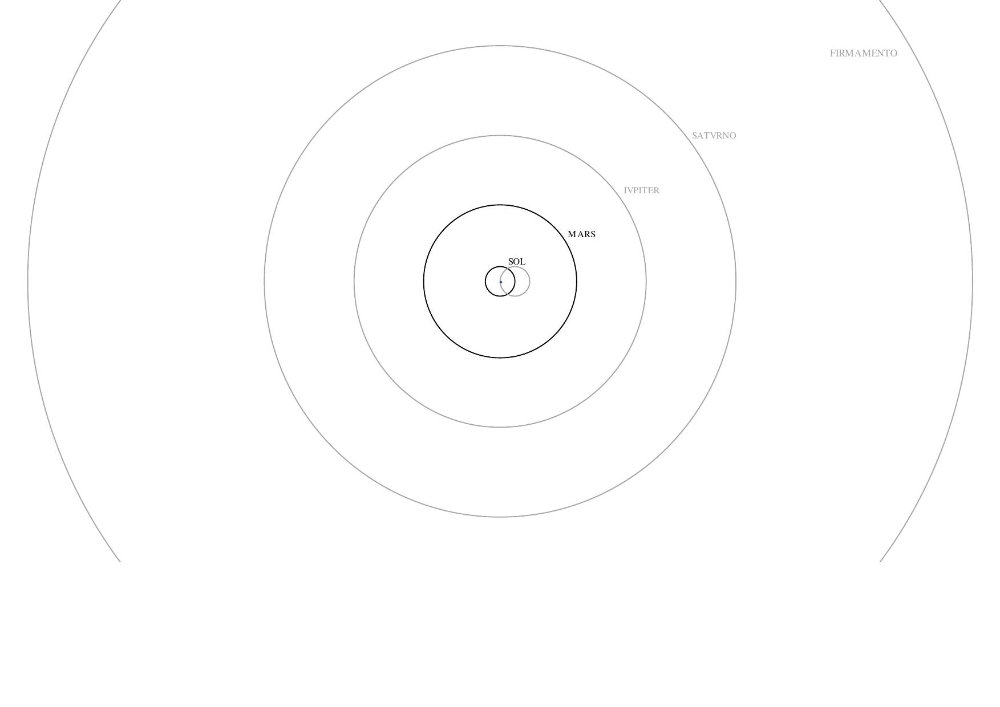

# velho01
*Cosmographia* (Velho, 1568), presented with elaborated and recalculated tables as well as corresponding images of the solar system.

Display of content and translation of sphere parameters starting at the top right in a clockwise direction.		
~~~
Content			Text	

1) Arc length BL(1∡°)	Legoas de hu grao : e cada hu globo celeste

with BL(1∡°) = U/360	Arc length per degree in legues.	

2) Circumference U	Legoas do mayor circulo de cada hu globo C'eleste.	
				
with U = πD		Sphere circumference in legues.	

3) Diameter D		Legoas do diametro de cada hu globo celeste.	

with D = 2r		Sphere diameter in legues.	

4) Width b		Legoas da gro sura de cada hu globo cesleste.	

with b(n) = r(n)-r(n-1)	Sphere width in legues.	
	

5) Distance d		Legoas ate o centro da terra ‐ de cada hu globo celeste.

with Radius r = d	Distance from the center of the earth or sphere radius in legues.
~~~
				

## References
Velho, B. (1568). *Principio da verdadeira cosmographia ... per Bartholomeu Velho portugues/neste anno de 1568*. Paris: Bibliothèque nationale de France. http://catalogue.bnf.fr/ark:/12148/cb416166390.
