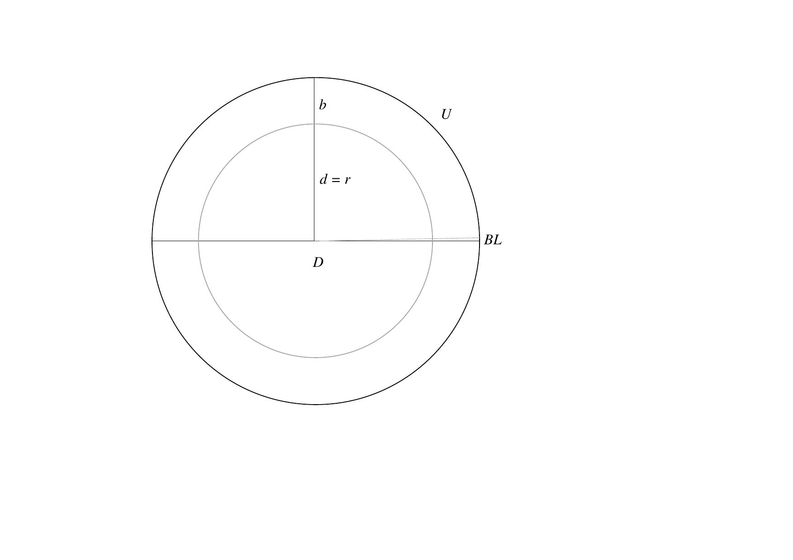
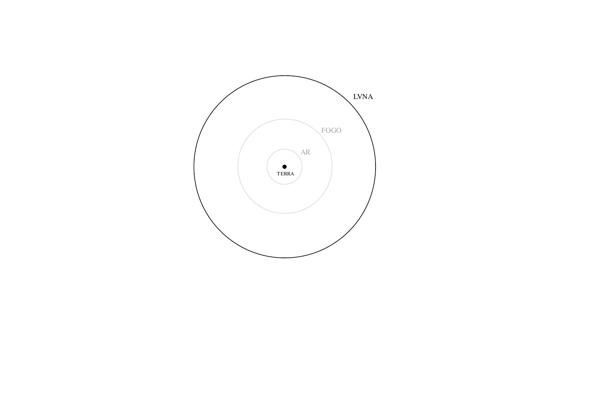

# Velho's Cosmographia tables
Bartholomeu Velho's *Cosmographia* illustration (1568, fol. 9v-10r) depicting his geocentric model (c.f. Domosh et al., 2020, p. 28) with tables elaborated and recalculated as well as presented with corresponding images of *his*  Solar System:

>„ [...] the Bibliotheque Nationale succeeded in acquiring the manuscript in which the Portuguese Bartolomeu Velho summarised his cosmographic knowledge for the benefit of King Charles IX of France [...] This volume consists of 23 cosmographic tavoadas and figuras illustrated by representations of the terrestrial globe on different projections and allegorical figures of the Moon, Mercury, Venus, the Sun, Jupiter and Saturn  [...] the work, which Velho compiled at the request of Francisco d'Albagno, remained in the latter's possession and was not delivered to the king owing to the author's death [...] Soon after, it passed to Giovanni Andreozzi [...] who in 1576 offered it to the Grand Duke Francis of Tuscany [...]  it was discovered in the library of M. Ferreira das Neves [...] and studied in 1890 [...] The MS. reappeared in the library of Ch. Chadenat, whence it passed into the Bibliotheque Nationale on March 13, 1950 [...] “, (Foncin, 1960, p. 43-44).

See also Codazzi (1964, p. 78) and Cortesão (1965, 2009, respectively).

Translation of the *headline* text.		
~~~
portugues	FIGURA DOS CORPOS CELESTES			
english		Picture of the celestial bodies.
~~~

Display and translation of *sphere parameters* starting at the top right in a clockwise direction (c.f. fig. 1).		
~~~
Parameter		Text	

1) Arc length BL	Legoas de hu grao : e cada hu globo celeste
                	Arc length per degree in legues.	

2) Circumference U	Legoas do mayor circulo de cada hu globo C'eleste.				
          		Sphere circumference in legues.	

3) Diameter D		Legoas do diametro de cada hu globo celeste.	
         		Sphere diameter in legues.	

4) Width b		Legoas da gro sura de cada hu globo cesleste.	
                	Sphere width in legues.	
	
5) Distance d		Legoas ate o centro da terra ‐ de cada hu globo celeste.
                	Distance from the center of the earth or sphere radius in legues.  
~~~
Figure 1. 		

Arc length *BL* per degree $∡°$ is calculated by

$$BL_{∡°}=\frac{U}{360},$$

where circumference $U=\pi_0⋅D$ and diameter $D=2⋅r$. The *corresponding* circular constant $\pi_0$ used by Velho can be derived from given $U_0$ and $D_0$ as

$$\pi_0=\frac{U_0}{D_0}= 3.\overline{142857}$$

or $\pi_0=\frac{22}{7}$, respectively. Width $b$ at given $n$ is calculated by

$$b_n=r_n-r_{(n-1)},$$

where radius $r$ equals distance $d$.

Translation of the *rotation* descriptions.		
~~~
Texto em portogues		english

R. DA LVA			Orbital period of the Moon
EN 27 DIAS E 8 ORAS		in 27 days and 8 hours.

R. DE MERCVRIO			Orbital period of Mercury
EN 70 DIAS E 7 ORAS		in 70 days and 7 hours.

REVOLVCAO DE VENUS		Orbital period of Venus
EN 273 DIAS E 23 ORAS		in 273 days and 23 hours.

REVOLVCAC DO SOL		Orbital period of the Sun
EN 365 DIAS E SEIS ORAS		in 365 days and six hours.

REVOLVCAO DE MARS		Orbital period of Mars
EN DOVS ANNOS			in two years.

REVOLVCAO DO CEO D IVPITER	Orbital period of the Jupiter sky
EN DOZE ANNOS			in twelve years.

REVOLVCAO DO CEO D SATVRNO	Orbital period of the Saturn sky
EN TRINTA ANNOS			in thirty years.

REVOLVCAO DO CEO DAS ES TRELAS	Orbital period of the starry sky
EN 36000 ANOS			in 36000 years.

REVOLVCAO DO PRIMO		Orbital period of the first
MOBILE EM 24 ORAS		mobile in 24 hours.

CELVM EMPIREVM HABITACVLVM	Heaven of the home of
DEI ET OMNIVM ELECTORUM		God and all chosen ones.
~~~
Radius *r*, distances *d*, res., given in *Legoas* $L$ converted into kilometers *km*, with *Légua terrestre*[^1] $L_t=6.600km$ and *Légua antiga* $L_a=6.197km$ (c.f. Costa, 1994).
[^1]:Land league in the colonial period of Brazil.
~~~
                km		
        	L(t)             L(a)
	
Terra	 	6 615,00         6 211,08 	
Ar	 	66 151,80 	 62 112,53 	 
Fogo		180 076,05 	 169 080,50 	 
Luna		344 092,65 	 323 082,14 	 
Mercurio	895 537,50 	 840 855,44 	 
Venus		4 974 750,00 	 4 670 988,75 	 
Sol	 	6 627 225,00 	 6 222 562,63 	 
Mars	 	34 430 550,00 	 32 328 199,75 	 
Jupiter	 	65 894 812,50 	 61 871 235,31 	 
Saturno	 	104 737 875,00 	 98 342 516,88 	 
Firmamento	212 577 750,00 	 199 597 623,75  
~~~
Velho's universe up to the *firmament* therefore has a size that roughly extends to the *orbit of Mars*, with semimajor axis $d=227956000km$ (c.f. Williams, 2024).
For the corresponding *distances* or *sizes* of the spheres c.f. fig. 2.  
At this point it also becomes clear that, given the distances shown, it hardly makes any difference in the *overall* picture whether you place the Earth or the Sun in the center (see `velho_tab01.md`, `velho_tab02.md` and `velho_tab03.md` tables).  

Figure 2.

In this context see *Anaxagoras* and his concepts of the *primum mobile* and *nous* (c.f. Ferchius, 1646), *Pythagoras‘* doctrine of *musica universalis* (c.f. Davis et al., 1901) and *Plato’s* fifth *etheric* element, the *quintessence* (see e.g. Böckh, 1852):

>„As the eyes, said I, seem formed for studying astronomy, so do the ears seem formed for harmonious motions: and these seem to be twin sciences to one another, as also the Pythagoreans say.", (Davis et al., 1901, p. 252).
>
For further readings see e.g. Campbell (1978, p. 105), Furtado (2022), Krtalić & McIntosh (2022) or Meirinhos (2022).

## References

Böckh, A. (1852). *Untersuchungen Über Das Kosmische System Des Platon: Mit Bezug Auf Hrn. Gruppe’s Kosmische Systeme Der Griechen ; Sendschreiben an Alexander von Humboldt*. Berlin: Verlag von Veit & Comp. https://doi.org/10.3931/e-rara-90691.

Campbell, T. (1978). Chronicle. *Imago Mundi 30*: 103–8. http://www.jstor.org/stable/1150712.

Codazzi, A. (1964). The Contribution of Roberto Almagià to the History of Cartography. *Imago Mundi 18*: 78–80. http://www.jstor.org/stable/1150381.

Cortesão, J. (1965). *História do Brasil nos Velhos Mapas*. Vol. 2. História Do Brasil Nos Velhos Mapas. Brasilia: Ministor̄io das Relações Exteriores, Instituto Rio Branco. https://books.google.com/books?id=9TkNAAAAYAAJ.

———. (2009). *História Do Brasil Nos Velhos Mapas - Obras Completas IX*. Portuguese. Vol. 1. Lisbon: INCM – Imprensa Nacional Casa da Moeda. https://www.amazon.com/Hist%C3%B3ria-Brasil-Velhos-Mapas-portugiesisch/dp/9722717952.

Costa, I. (1994). Pesos e medidas no período colonial brasileiro: denominações e relações. *Boletim de História Demográfica 1* (1). http://historia_demografica.tripod.com/bhds/bhd1.htm#pesos.

Davis, H., Burges, G., & Rooker, G. Z. (1901). *The Republic: The Statesman of Plato*. London & New York: M. Walter Dunne. https://archive.org/details/republicstatesma00plat_0/.

Domosh, M., Heffernan, M., & Withers, C.W.J. (2020). *The SAGE Handbook of Historical Geography*. Thousand Oaks, California: SAGE Publications. https://books.google.com/books?id=8n7vDwAAQBAJ.

Ferchius, M. (1646). *De Caelesti Svbstantia: Et Eius Ortu, Ac Motu in Sententia Anaxagorae Philosophi Celeberrimi*. Venetiis: apud Haeredes Ioannis Salis. https://doi.org/10.3931/e-rara-73987.

Foncin, M. (1960). Some Manuscript Maps Recently Acquired by the Département Des Cartes Et Plans of the Bibliothèque Nationale, Paris. *Imago Mundi 15*: 40–45. http://www.jstor.org/stable/1150275.

Furtado, J. F. (2022). Cartography in the Administration of Portuguese America from the 16th to 18th Centuries. In *The Oxford Encyclopedia of Brazilian History and Culture*, edited by Palacios, G. Oxford: University Press. https://doi.org/10.1093/acrefore/9780199366439.013.773.

Krtalić, Š., & McIntosh, G. C. (2022). Two Sixteenth-Century Nautical Charts of the South Atlantic Ocean: An Early Example of Cartography Used at Sea. *Journal of Navigation 75* (6): 1280–97. https://doi.org/10.1017/S0373463322000662.

Meirinhos, J. F. (2022). Celestial Bodies and Dimension of the Universe in Bartolomeu Velho’s Cosmographia. In *From Wisdom to Data: Philosophical Atlas on Visual Representations of Knowledge*, edited by Higuera, J.G., Romele, A., Rodighiero, D., & Pedro, C. Coleção Transversal. Porto: University of Porto Press. https://books.google.com/books?id=EAEezwEACAAJ.

Velho, B. (1568). *Principio da verdadeira cosmographia ... per Bartholomeu Velho portugues/neste anno de 1568*. Paris: Bibliothèque nationale de France. http://catalogue.bnf.fr/ark:/12148/cb416166390.

Williams, D. R. (2024). *Mars Fact Sheet*. NASA Goddard Space Flight Center. https://nssdc.gsfc.nasa.gov/planetary/factsheet/marsfact.html.
